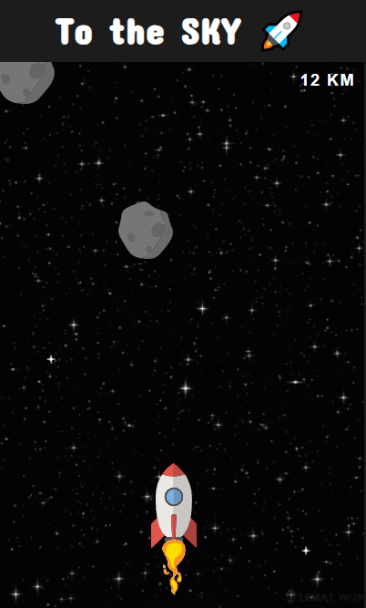

## Introducing "Go to SKY"
The ultimate space adventure! Strap in and get ready to embark on an exhilarating journey through the cosmos in your very own rocket. In this simple and hilarious game, you'll take control of a brave rocket as it zooms into the sky, facing a perilous obstacle course of asteroids. Your mission? Dodge, duck, and weave your way through the treacherous asteroid field, all while keeping your rocket intact and reaching for the stars! But beware, these asteroids aren't your typical space rocks. They come in all shapes and sizes, each with their own unique movement patterns. You'll need lightning-fast reflexes and sharp decision-making skills to navigate through the chaos. The game features intuitive controls that make it easy for players of all ages to jump right in and start their intergalactic adventure. Simply swipe left or right to maneuver your rocket and avoid those pesky asteroids. As you progress, the challenge intensifies, with the asteroids becoming more frequent and unpredictable. But it's not all doom and gloom in the vastness of space! Along your journey, keep an eye out for power-ups that will give your rocket an extra boost. From speed boosts to shields that protect you from collisions, these power-ups will give you the edge you need to conquer the asteroid field and set new high scores. Go to SKY is not just about surviving; it's about having a blast while doing so! With its vibrant graphics, catchy sound effects, and addictive gameplay, this game promises to keep you entertained for hours on end. So, what are you waiting for? Strap yourself in and prepare for the ride of a lifetime. 

Download Go to SKY now and get ready to dodge, dip, dive, and dodge your way to space supremacy!